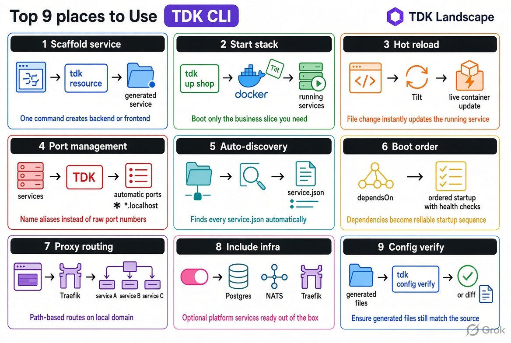

# TDK CLI — 在你的筆電上啟動服務

[English](README.md) | [简体中文](README-zh_cn.md) | 繁體中文 | [日本語](README-ja.md) | [한국어](README-ko.md)

TDK CLI 在你的筆電上啟動服務。它不是部署工具，也不是 Compose 檔案：在 `service.json` 中定義每個服務，然後執行 `tdk up`。機器上不需要 Kubernetes。

穩定性：1.x 本機開發。產生的檔案是一份契約；使用 `tdk config verify` 驗證。核心 CLI 採用 MIT 授權，不需要金鑰。Premium 為選用。

Docker 執行容器。Tilt 監看服務，並在你寫程式時即時更新容器。TDK CLI 撰寫 Tilt 使用的設定。正式環境部署仍交給 Helm、Argo CD 或 Kustomize。

[官網](https://tdk-landscape.github.io/tdk-website/) · [快速開始](https://tdk-landscape.github.io/tdk-website/docs/quickstart/) · [範例](https://tdk-landscape.github.io/tdk-website/docs/examples/) · [Awesome TDK](https://github.com/tdk-landscape/awesome-tdk-framework) · [示範](https://tdk-landscape.github.io/tdk-demo-animation/) · [回報問題](https://github.com/tdk-landscape/tdk-cli-core/issues)

## 誰在使用 TDK

目前還沒有團隊列入。成為第一個吧：[告訴我們你正在使用 TDK](https://github.com/tdk-landscape/tdk-cli-core/issues/new?template=we-use-tdk.yml)，或在 [ADOPTERS.md](ADOPTERS.md) 中新增一列。

## 快速開始

```bash
mkdir shop && cd shop
tdk project --yes
tdk resource orders-api --type backend --stack shop --yes
tdk up shop
curl http://api.shop.localhost:8080/api/orders/health
```


*建立後端與前端，然後列出整個 stack。*



如果 Helm、Compose 或你現有的 Tilt 設定已經提供可用的本機環境，請繼續使用。TDK CLI 適合需要管理多個服務、希望擁有清楚的本機服務契約，並用一個指令啟動整個 stack 的工程師。

請參閱 [TDK CLI 如何與 Helm 搭配](https://tdk-landscape.github.io/tdk-website/docs/with-helm/)、[服務 schema](engine/schemas/service-schema.json) 與[專案設定 schema](engine/schemas/project-schema.json)。

[](https://www.npmjs.com/package/@tdk-landscape/tdk-cli-core)
[](https://github.com/tdk-landscape/tdk-cli-core/actions/workflows/ci.yml)
[](https://github.com/tdk-landscape/tdk-cli-core/actions/workflows/quickstart-e2e.yml)
[](https://github.com/tdk-landscape/tdk-cli-core/actions/workflows/erp-scale-e2e.yml)
[](https://github.com/tdk-landscape/tdk-cli-core/actions/workflows/examples-e2e.yml)
[](https://snyk.io/test/github/tdk-landscape/tdk-cli-core)
[](https://socket.dev/npm/package/@tdk-landscape/tdk-cli-core/overview)
[](LICENSE)

## 安裝

從 npm 安裝 CLI（需要 Node.js 22.12+），或使用預先建置的二進位檔（不需要 Node.js 或 Bun）：

```bash
npm install -g @tdk-landscape/tdk-cli-core
# or install the prebuilt binary
curl -fsSL https://tdk-landscape.github.io/install.sh | sh
```

`tdk up shop --dry-run` 會在啟動容器之前預覽所選的本機服務與 URL。預設範本為 Bun/TypeScript；TDK 的核心角色是透過 Docker + Tilt 執行本機容器，而不是提供 Node.js 應用程式框架。請參閱[單一後端範例](examples/one-backend/README.md)。

## 何時不該使用 TDK

- 你現有的 Compose 或 Tilt 工作流程已經提供可用的本機環境。
- Helm 就是你完整的開發工作流程，且你不想在 Docker 上執行本機服務。
- 你不想使用 `service.json` 清單與產生的本機設定。

## 文件

- [文件索引](docs/README.md)
- [與 Helm 並用](docs/with-helm.md)
- [設定與編輯器 schema](docs/configuration.md)
- [可執行的單一後端範例](examples/one-backend/README.md)
- [可執行的 Python 後端範例](examples/one-backend-python/README.md)
- [完整的多服務範例](examples/tdk-example/README.md)
- [功能與授權限制](docs/FEATURES.md)
- [坦率的比較與已知限制](docs/compare-honest.md)
- [公開聲明登記表](docs/claims.md)
- [Show HN 草稿](docs/drafts/show-hn.md)
- [架構與儲存庫地圖](docs/project-overview.md)
- [規模測試夾具的量測結果與注意事項](docs/benchmarks/scale-bench.md)

## 歷史

TDK 比本儲存庫及其 npm 套件所顯示的更早。開發始於 2026 年 4 月 21 日，位於 [tdk-landscape/tdk](https://github.com/tdk-landscape/tdk)，該儲存庫現已封存並作為唯讀歷史保留；其第一個 commit 為 [`1714637`](https://github.com/tdk-landscape/tdk/commit/1714637637196ed54cbfa18534230a782c05ab36)（"Initial commit: TDK specs, generators, CLI, and standards"）。本儲存庫 `tdk-cli-core` 建立於 2026 年 9 月 19 日，開發在此持續進行；npm 上的 `@tdk-landscape/tdk-cli-core` 套件於 2026 年 9 月 21 日首次發布。因此，程式碼的淵源比你在 GitHub 與 npm 上看到的儲存庫與套件日期早約五個月。

## 需求與支援

本機執行需要安裝 Docker（Desktop、OrbStack 或 Colima；Engine 25+、Compose 2.20.2+）與 [Tilt](https://docs.tilt.dev/install.html)。預設產生的服務使用 Bun 1.2+。TDK 會從有界的備援範圍中為 HTTP、HTTPS 與 Postgres 選擇主機連接埠；可設定 `TDK_HTTP_PORT`、`TDK_HTTPS_PORT` 或 `TDK_POSTGRES_PORT` 來覆寫。TDK 支援 macOS、Linux，以及透過 WSL2 Ubuntu 的 Windows；原生 Windows 僅支援 CLI 檢查。執行 `tdk doctor` 檢查本機就緒狀態。請參閱 [WSL2 設定](docs/wsl2.md)。

在原生 Windows 上，`tdk --version`、`tdk doctor` 與 `tdk up --dry-run` 是僅檢查指令。`tdk up` 會以結束碼 2 結束，並顯示 “Landscape startup needs Ubuntu on WSL2. Native Windows is inspect-only.”

## 授權矩陣

| 功能 | 免費 | Premium |
| --- | --- | --- |
| `tdk up`、鷹架、Traefik、Postgres、Tilt 即時更新、golden layers | 是 | 是 |
| Verdaccio、DDD 鷹架、Sablier 閒置停止 | 否 | 需要金鑰 |
| Playwright、C4、AGENTS.md | 在儲存庫內產生則免費 | 僅當使用金鑰下載實作時 |

核心永遠免費。Premium 是針對上述額外功能的獨立金鑰；執行 `tdk up` 不需要金鑰。

**生態系地圖：** 範例、文章、相關工具與筆記位於 [awesome-tdk-framework](https://github.com/tdk-landscape/awesome-tdk-framework)。如果你執行的是這個 CLI，請為本儲存庫（`tdk-cli-core`）加星；其餘內容請透過 awesome 清單瀏覽。

## 貢獻與授權

歡迎貢獻。請從 [CONTRIBUTING.md](CONTRIBUTING.md) 與[貢獻者指南](docs/contributing/README.md)開始。請依照 [SECURITY.md](SECURITY.md) 回報安全性問題。

TDK 採用 MIT 授權；請參閱 [LICENSE](LICENSE)。
