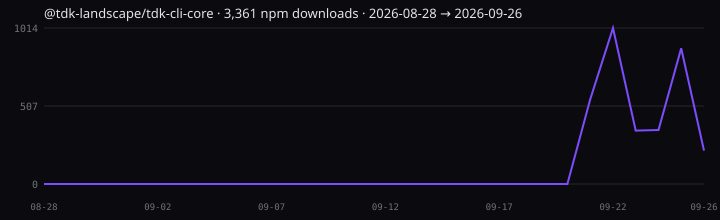

<div align="center">

# TDK — Tilt Development Kit

**Run your whole microservice landscape locally. No Kubernetes.**

One CLI that scaffolds your services and runs the whole landscape locally with hot reload, health checks, a proxy, and Postgres, all built on [Tilt](https://tilt.dev). Tested at scale: a 100-service fixture (small generated `/health` services) boots from nothing on a clean CI runner in about 8 minutes, and holds about 1.7 GiB of memory ([details](#cold-boot-on-a-clean-machine-ci)).

[](https://www.npmjs.com/package/@tdk-landscape/tdk-cli-core)
[](https://github.com/tdk-landscape/tdk-cli-core/actions/workflows/ci.yml)
[](https://github.com/tdk-landscape/tdk-cli-core/actions/workflows/quickstart-e2e.yml)
[](https://github.com/tdk-landscape/tdk-cli-core/actions/workflows/erp-scale-e2e.yml)
[](https://github.com/tdk-landscape/tdk-cli-core/actions/workflows/examples-e2e.yml)
[](https://snyk.io/test/github/tdk-landscape/tdk-cli-core)
[](https://socket.dev/npm/package/@tdk-landscape/tdk-cli-core/overview)
[](LICENSE)

[Website](https://tdk-landscape.github.io/tdk-website) · [Quickstart](https://tdk-landscape.github.io/tdk-website/docs/quickstart/) · [Examples](https://tdk-landscape.github.io/tdk-website/docs/examples/) · [Demo](https://tdk-landscape.github.io/tdk-demo-animation/) · [Report a bug](https://github.com/tdk-landscape/tdk-cli-core/issues/new/choose)

</div>

```bash
npm install -g @tdk-landscape/tdk-cli-core
npx @tdk-landscape/tdk-cli-core
mkdir shop && cd shop                                   # tdk writes files into the current directory
tdk project --yes                                       # set up the project
tdk resource orders-api --type backend --stack shop     # scaffold a service
tdk up shop                                             # run it with hot reload
```



Want to inspect a stack before starting containers? `tdk up shop --dry-run` shows the services and local URLs without Docker or Tilt installed.



**Requirements:** Docker (Desktop, OrbStack or Colima; Engine 25+, Compose 2.20+), [Tilt](https://docs.tilt.dev/install.html), [Bun](https://bun.sh) for the generated services, and Node.js 22.12+ for npm installs. Ports 80, 443 and 5432 must be free (a local Postgres is the usual conflict). macOS and Linux releases are available. On Windows, use Ubuntu on WSL2 with Docker Desktop's WSL integration; full landscape startup is currently supported through that Linux environment. See the [WSL2 setup guide](docs/wsl2.md). Run `tdk doctor` to check your setup.

This is the core monorepo for TDK: the `tdk` CLI, the Starlark-based Tilt orchestration engine that powers it, and the discovery system that turns a directory of services into a running local landscape.

## Why TDK?

| | docker-compose | Local Kubernetes (kind, minikube) | Plain Tilt | **TDK** |
|---|---|---|---|---|
| Scaffold a new service in one command | ❌ | ❌ | ❌ | ✅ `tdk resource` |
| Hot reload on file change | ⚠️ `compose watch` config | ⚠️ extra tooling | ✅ | ✅ |
| Health-checked startup order | ✅ `depends_on: condition: service_healthy` | ✅ | ⚠️ write it yourself | ✅ |
| Proxy, Postgres, monitoring included | ❌ | ❌ | ❌ | ✅ |
| Needs a cluster | No | Yes | Optional | **No** |
| Start only one stack of a large system | ⚠️ profiles | ⚠️ | ⚠️ | ✅ `tdk up <stack>` |

TDK is not a replacement for Tilt: it generates the Tiltfile, Dockerfiles and compose files and then runs Tilt. If you already have a hand-written Tiltfile or compose setup you're happy with, TDK mostly saves you the boilerplate for the next service.

## Benchmark: 100 services on one laptop

Measured with [`scripts/benchmark/container-scale.ts`](scripts/benchmark/README.md) against the 100-service [ERP example](https://github.com/tdk-landscape/tdk-erp-system) on a 16 GB machine (Docker VM: 7.75 GiB). Raw results are in [`benchmarks/results/`](benchmarks/results).

| Services | All healthy after | Total memory | Avg memory / service | Crashes / OOM kills |
|---:|---:|---:|---:|---:|
| 10 | 8 s | 161 MiB | 16 MiB | 0 / 0 |
| 50 | 24 s | 829 MiB | 17 MiB | 0 / 0 |
| 100 | 112 s | 1.6 GiB | 17 MiB | 0 / 0 |

What this does and doesn't measure:

- The ERP services are small generated Bun HTTP services (about 20 lines each) answering `/health`. Real services with real dependencies use more memory; the point is that TDK's per-service overhead (runtime image, healthchecks, proxy routing) stays small.
- Images were already built, so build time isn't included. The clean-machine run below includes it.
- The script starts the service containers with the settings `tdk up` generates (512 MiB / 0.5 CPU limits, healthchecks), without Tilt running. The memory column counts only the service containers, not Postgres or Traefik.
- Numbers vary between runs (a later run reached 100 healthy in 74 s). Run it yourself with `bun scripts/benchmark/container-scale.ts`.

### Cold boot on a clean machine (CI)

The table above is a warm start. Two workflows install the published CLI on a fresh GitHub-hosted Ubuntu runner and run `tdk up` from nothing, building every image:

- [**Quickstart E2E**](.github/workflows/quickstart-e2e.yml): the commands from the top of this README, one scaffolded backend, until it answers `/health` through Traefik. About 4 minutes. Runs after each release and daily.
- [**ERP scale E2E**](.github/workflows/erp-scale-e2e.yml): the 100-service example. [Run 36395860088](https://github.com/tdk-landscape/tdk-cli-core/actions/runs/36395860088) (CLI 1.3.72, 4 vCPU / 15 GB): **100 / 100 backends healthy through Traefik after 472 s**, 111 containers, 1.8 GiB used by all containers. Runs weekly.

Both are Linux/Ubuntu CI fixtures: generated services answering `/health`, not a real business app. A green run means TDK can generate, build, route and health-check a landscape of that size on a clean Ubuntu runner. Windows now has a separate smoke workflow for CLI startup and unit tests, but it does not boot a full landscape on Windows. These CI runs also don't cover Apple Silicon or an existing repo you bring yourself.

## What is TDK?

TDK organizes microservices using a **Project → Stack → Resource** hierarchy, then uses Tilt to build, run, and hot-reload them locally:

```
Project (1 per repo)
├── TILT_RESOURCE_DEFAULTS.star   # Ports, health checks, memory
├── TILT_TECH_STACK.star          # Bun, Vite, Prisma, NATS
│
└── Stacks (deployment groups)
    ├── api-stack
    │   ├── api-backend      # Resource
    │   └── web-frontend     # Resource
    │
    └── worker-stack
        ├── worker-backend
        └── web-frontend
```

`.tdk/project.json` also groups stacks into phases (`pre_alpha`, `alpha`, `beta`, `out_of_scope`) so a large system can be brought up in stages. `tdk up` runs stacks from the first three and adds any new stack to `pre_alpha`.

Running `tdk resource` scaffolds a service (Dockerfile, TypeScript config, starter code, tests); `tdk up` hands the whole landscape to Tilt for orchestration, live-reload, and health checking — sized to fit dozens of services on a single laptop.

## Install

```bash
npm install -g @tdk-landscape/tdk-cli-core
# or
bun install -g @tdk-landscape/tdk-cli-core
```

Or install the prebuilt binary (no Node or Bun needed; verified against the release checksums):

```bash
curl -fsSL https://tdk-landscape.github.io/install.sh | sh
```

Premium features don't need a different install: set `TDK_LICENSE_KEY` and any of these installs unlocks them. See [docs/FEATURES.md](docs/FEATURES.md).

## Quick start

```bash
mkdir shop && cd shop
tdk project --yes                                     # writes .tdk/project.json and generated configs
tdk resource orders-api --type backend --stack shop   # asks you to confirm, then scaffolds services/shop/orders-api
tdk resource storefront --type frontend --stack shop
tdk up shop                                           # starts Tilt; UI at http://localhost:10350
tdk networks                                          # lists the *.localhost URLs Traefik routes
tdk down                                              # stops everything
```

See the [CLI reference](cli/README.md) for the full command set (`stack`, `resources`, `doctor`, `ui`, and more).

## Repository layout

This is a monorepo — most day-to-day CLI work happens under `cli/`, while `engine/` and `discovery/` implement the Tilt-side orchestration that the CLI drives.

| Path | What it is |
|------|------------|
| [`cli/`](cli) | The `tdk` CLI source (TypeScript/Bun) — commands, UI, templates. See [cli/README.md](cli/README.md). |
| [`engine/`](engine) | The Starlark Tilt framework: topology modules for Docker, networking, database virtualization, secrets, observability. See [engine/README.md](engine/README.md). |
| [`discovery/`](discovery) | Manifest-driven service discovery — scans `service.json` files and builds the resource/dependency graph consumed by the engine. |
| [`ext/`](ext) | Tilt extension (`ext://tdk-cli`) plus IDE/UI enhancement components. |
| [`scripts/`](scripts) | Release, benchmarking, and dev-environment scripts (git hooks, pre-commit, idle-footprint measurement). |
| [`benchmarks/`](benchmarks) | Container/landscape scale benchmarks. |
| [`docs/`](docs) | Reference docs, including [FEATURES.md](docs/FEATURES.md) for project- and resource-level feature flags. |
| [`Tiltfile`](Tiltfile) | Entry point that wires the engine into `tilt up`. |
| [`install.sh`](install.sh) | Legacy installer URL; hands off to the official installer at `tdk-landscape.github.io/install.sh`. |

## Features

TDK ships a set of always-on infrastructure services (Traefik proxy, PostgreSQL) plus opt-in features — monitoring, ELK, Debezium CDC, a local npm registry, and more. Enable/disable them per-project via `.tdk/project.json`, or per-resource via each service's `service.json`. Full reference: [docs/FEATURES.md](docs/FEATURES.md).

## Free and paid features

The CLI, engine and everything in this repository are MIT-licensed and work without an account or key. A few extras are paid and need a `TDK_LICENSE_KEY`: on-demand start/stop of idle services (Sablier), a local npm registry (Verdaccio), DDD scaffolding, Playwright config, C4 diagrams, synthetic monitoring, and a few generators (see `KNOWN_RESOURCES` in [extension-fetch.ts](cli/src/generator/extension-fetch.ts)). In this repo those are disabled stubs; with a key set, the CLI downloads the real implementations. [docs/FEATURES.md](docs/FEATURES.md) marks which features are which. To get a key, use the [request form on the website](https://tdk-landscape.github.io/tdk-website/#waitlist) or open a [Premium license request](https://github.com/tdk-landscape/tdk-cli-core/issues/new?template=premium_license.yml).

## Network access and telemetry

TDK has no telemetry or analytics. The CLI only goes online when you ask it to:

- `tdk upgrade` checks the latest release on GitHub.
- With `TDK_LICENSE_KEY` set, `tdk project` and `tdk up` download the paid bundle from `tdk-extension-dist.oranguman.workers.dev` and re-check the key every 12 hours. Without a key, nothing is sent.
- Docker and Tilt pull images and packages as they normally would.
- Tilt, which TDK runs, has its own anonymous usage analytics. Turn them off with `tilt analytics opt out`.

## FAQ

**Why not just docker compose?** For a handful of services, compose is fine. TDK generates the compose files for you. It adds hot reload through Tilt, one-command scaffolding with matching Dockerfiles, and a stack-level `tdk up` for large systems where starting everything is too slow.

**How is this different from Skaffold, Garden, DevSpace or Tilt itself?** Skaffold, Garden and DevSpace are built around Kubernetes, and plain Tilt leaves the Tiltfile to you. TDK runs on plain Docker with no cluster, and generates both the services and the Tilt config from a `service.json` per service.

See the [honest comparison](docs/compare-honest.md) for tradeoffs and cases where TDK may not fit.

**Do I need 100 microservices?** No. Two services work the same way. The 100-service example is a stress test to show the overhead stays flat.

**Is TDK affiliated with Tilt or Docker?** No. TDK is an independent project built on top of [Tilt](https://tilt.dev), which is maintained by Docker, Inc.

## Development

```bash
make help          # list all make targets
make test          # run the full test suite
make test-fast      # fast unit tests, no external deps
make pre-commit-run # run pre-commit hooks on all files
```

`npm run typecheck` / `npm run lint` / `npm run test` delegate to the `cli/` workspace. If you're contributing, start with the [step-by-step contributor guide](docs/contributing/README.md) for subsystem-specific instructions.

## Environment check

### Cold npx / first run

```bash
npx @tdk-landscape/tdk-cli-core
npx @tdk-landscape/tdk-cli-core doctor
```

Ranked first failures: Node 22.12+, Docker Engine 25+, Compose 2.20.2+, Tilt, Bun 1.2+, and ports 80/443/5432.
Install Bun 1.2+ as a machine prerequisite. `tdk project` generates the stack configuration; Prisma and NATS are project-specific, and NATS is required only when the feature is enabled.

```bash
tdk doctor
```

Checks Docker, Compose and Tilt. Inside a project it also checks the generated configs, `.env`, service scripts and that the ingress ports are free, before you run `tdk up`. It also catches wiring mistakes: a resource without `package.json`, a `params` URL that uses the wrong port for another service, a frontend calling a backend on `localhost:<port>`, the `nats` feature without a broker to start, duplicate Tilt processes, and Docker running out of network address space.

## Community

- **Questions and ideas:** [open an issue](https://github.com/tdk-landscape/tdk-cli-core/issues/new/choose).
- **Contributing:** see [CONTRIBUTING.md](CONTRIBUTING.md) and the [step-by-step guide](docs/contributing/README.md). Issues labeled [`good first issue`](https://github.com/tdk-landscape/tdk-cli-core/labels/good%20first%20issue) are a good place to start.
- **Security:** see [SECURITY.md](SECURITY.md). Please don't report vulnerabilities in public issues.
- **Examples:** [ERP system (100 services)](https://github.com/tdk-landscape/tdk-erp-system), [SaaS starter](https://github.com/tdk-landscape/tdk-saas-starter), [restaurant](https://github.com/tdk-landscape/tdk-restaurant-example), [ecommerce (Vue + Hono)](https://github.com/tdk-landscape/tdk-ecommerce-example).

## License

[MIT](LICENSE) © [TDK Landscape](https://github.com/tdk-landscape)
