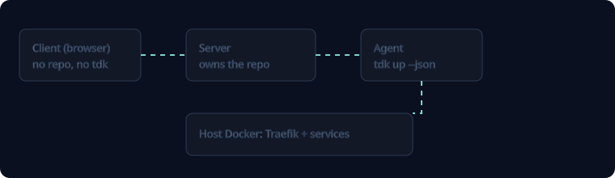

# Agent hosts: Dev Containers, Codespaces, WebContainers

`tdk doctor` reports where it is running (`data.host.kind` in `--json`): `local`, `wsl2`, `devcontainer`, `codespaces`, `webcontainer`, or `native-windows`. `data.host.containerRuntimeReachable` says whether doctor found a working container runtime (Docker, Colima or Podman), and `data.host.canUp` is false when `tdk up` cannot work: on a WebContainer, on native Windows without `TDK_ALLOW_NATIVE_WINDOWS=1`, or when no container runtime is reachable.

## Dev Containers and Codespaces

Services run as sibling containers on the host's Docker engine; the Dev Container is only where the agent and `tdk` live.

- Supported: Docker-outside-of-Docker. Mount the host socket (`-v /var/run/docker.sock:/var/run/docker.sock`) or add the `docker-outside-of-docker` Dev Container feature.
- Not supported: Docker-in-Docker (Tilt bind mounts and the layer cache break).
- A mounted Docker socket gives the container root-equivalent access to the host. Only do this in workspaces you trust.

If Docker is unreachable, `tdk up` exits non-zero without starting Tilt and `tdk doctor` prints this remediation.

## T3-style servers

A server that owns the repo and starts the agent (for example T3 Code) works when the agent runs `tdk` on a machine with Docker, with the services running as sibling containers on that host.

The agent runs `tdk doctor`, then `tdk up --json` in the background, and polls `tdk status --json` for ports and URLs. Do not point such a server at a WebContainer: `canUp` stays false there.

## WebContainers

Not supported for `tdk up`. A WebContainer has no Docker daemon, Compose, or Tilt. `tdk doctor --json` reports `canUp: false` and `tdk up` exits non-zero without spawning Tilt. Run TDK on a machine with Docker and call it from the agent.

## JSON output for agents

- `tdk doctor --json` and `tdk status --json` print a versioned report.
- `tdk up --json` prints one object on stdout: `ok: true` once every non-deferred Tilt resource is built and running, or `ok: false` with `errors` if a resource fails, readiness times out (`TDK_UP_READY_TIMEOUT_MS`, default 15 minutes), a smoke check fails, or Tilt exits first. Tilt keeps running after the object is printed, so background the command. Human output is suppressed.
- `tdk logs --json [--service <name...>] [--tail <n>] [--since <duration>] [--port <n>]` prints one object with the most recent lines (default 200, never unbounded) and exits. Each line has `time`, `resource`, `level`, `source` and `text`. `--tail` is 1 to 10000. An unknown service is an error that lists valid names (when Tilt cannot list its resources, that check is skipped and the logs call reports the real error). Errors are `USAGE` (exit 2), `UNKNOWN_SERVICE` (exit 2), `TILT_MISSING`, `TILT_NOT_RUNNING` (no Tilt server answered) and `TILT_LOGS_FAILED` (Tilt rejected the call). It reads from the running Tilt on localhost (`--port`, or `TILT_PORT`). There is no follow mode in JSON.
- `tdk down --json` prints one object when done, including when preflight fails.
