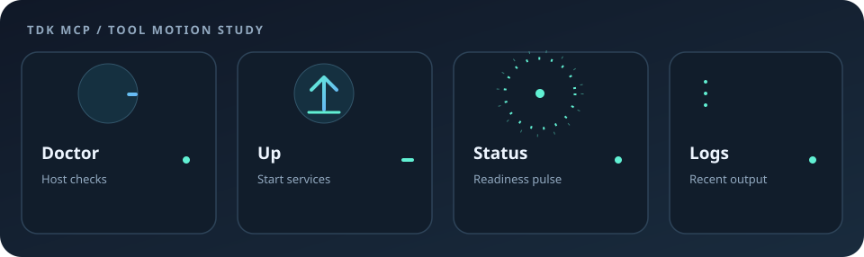

# Use TDK tools from Codex

This guide shows how to use the TDK MCP in Codex to check your machine, inspect a TDK project, start services, and read their logs. You can ask in plain language; you do not need to write JavaScript or call the tools by name.



## Connect the MCP in Codex

This repository already includes a project-scoped MCP entry in `.codex/config.toml`:

```toml
[mcp_servers.tdk]
command = "tdk"
args = ["mcp"]
```

For another project, connect the local TDK server in either of these ways:

- **Codex desktop app:** open **Settings → MCP servers → Add server**. Choose **STDIO**, set the command to `tdk`, add `mcp` as its argument, save, then select **Restart**.
- **Codex CLI:** run `codex mcp add tdk -- tdk mcp`.

Project-scoped MCP settings load for trusted projects. Confirm the connection in the desktop app with `/mcp`, or in the CLI with `codex mcp list`. The desktop app, CLI, and IDE extension share MCP configuration. See [Codex MCP setup](https://developers.openai.com/codex/extend/mcp) for other setup options.

## Before you start

- Install TDK and its host requirements. See the [operator runbook](../operator-runbook.md).
- Open the TDK project you want to work with in Codex. Project actions need the workspace root to contain `.tdk/project.json`.

The `doctor` check can run before a project is open; listing resources, checking project status, and starting a stack need a TDK project.

## A first run

### 1. Check whether the machine is ready

In Codex, ask:

> Run TDK doctor. Tell me what would block a stack from starting, and do not start anything yet.

Doctor checks Docker, Tilt, Docker Compose, host ports, and other local requirements. If a check fails, fix the reported issue and ask Codex to run doctor again. The result includes a readiness flag and a suggested fix for each failed check.

### 2. Inspect your project

With the TDK project open, ask:

> List this project's TDK services and show their stack, type, and port. Then check which services are ready.

Codex uses the resource list and status tools for this. If you see `Could not find project root`, open the directory that contains `.tdk/project.json` in Codex and retry.

### 3. Start the stack

When doctor passes, ask:

> Start the TDK stack for this project, then check status until Tilt reports readiness.

TDK starts the stack in the background. Starting successfully does not mean every service is healthy yet, so check status afterward. You can start a subset by naming the services:

> Start only the `web` service and its dependencies, then check status.

### 4. Look at logs or stop the stack

Ask for a recent log snapshot, optionally naming a service and time window:

> Show the last 10 minutes of API logs.

When you are done, ask:

> Stop this project's TDK stack.

## What to ask Codex

| Goal | Example request |
| --- | --- |
| Check machine prerequisites | “Run TDK doctor and explain anything that needs fixing.” |
| Find services | “List this project's TDK resources.” |
| Check readiness | “Show the TDK status and tell me which services are ready.” |
| Start everything | “Start this project's TDK stack, then check status.” |
| Start selected services | “Start `web` and its dependencies.” |
| Inspect logs | “Show the latest 200 lines from `api`.” |
| Stop services | “Stop this project's TDK stack.” |

## If something goes wrong

- **Docker is not running:** start Docker Desktop, OrbStack, or Colima, then run doctor again.
- **Tilt CLI or Docker Compose is missing:** install the missing prerequisite using the links in the doctor output, then retry.
- **`Could not find project root`:** open the TDK project's root directory, the one containing `.tdk/project.json`.
- **Doctor passes but a service is not ready:** check project status and ask for that service's recent logs. Doctor checks the host and project configuration; it does not guarantee every running service is healthy.

## Tool reference

The MCP tools are `doctor`, `resource_list`, `status`, `up`, `logs`, and `down`. Codex selects them from your request. If you are writing an integration that calls them directly, see the [TDK MCP quick guide](tdk-mcp.md). For the CLI's JSON output and exit codes, see the [machine-readable CLI reference](../reference/machine-readable-cli.md) and the [doctor contract](../reference/doctor-contract.md).
