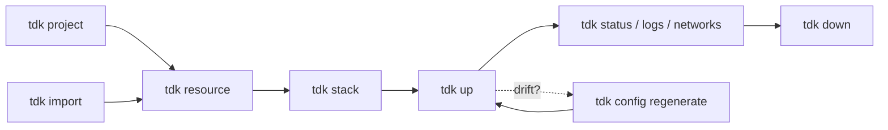

# ⚡ TDK mega cheat sheet

> Every `tdk` command, alias and flag on one page. Taken from `tdk <command> --help` for **v1.3.125**. Your version may differ, so run `tdk <command> --help` to check.

**Jump to:** [🚀 Start](#-first-five-minutes) · [🔥 Top 10](#-top-10) · [🗺️ Map](#️-how-it-fits-together) · [🌍 Project](#-project) · [📦 Resources](#-resources) · [🗂️ Stacks](#️-stacks) · [▶️ Lifecycle](#️-lifecycle) · [⚙️ Config](#️-configuration) · [🩺 Diagnostics](#-diagnostics-and-tooling) · [🤖 JSON](#-json-output-and-exit-codes) · [🌱 Env](#-environment-variables) · [📁 Files](#-files-tdk-writes) · [🍳 Recipes](#-recipes)

Want the short version? See the [10-row cheat sheet](../cli/README.md#cheat-sheet).

> [!NOTE]
> Needs Docker (Engine 25+, Compose 2.20.2+), [Tilt](https://docs.tilt.dev/install.html), and Bun 1.2+ for the default generated services. On Windows, run the CLI in WSL2 ([setup](wsl2.md)).

## 🚀 First five minutes

```bash
curl -fsSL https://tdk-landscape.github.io/install.sh | sh   # install
tdk doctor                                                  # Docker, Tilt and Bun OK?
tdk project --yes                                           # create the project
tdk resource api --type backend --stack api --yes           # a Bun + Hono API
tdk resource web --type frontend --stack api --yes          # a React app
tdk up api                                                  # start the stack
tdk networks                                                # where is everything?
tdk down --force                                            # stop it all
```

> [!TIP]
> Run `tdk` with no arguments for a quick readiness check. It exits 1 if your machine is not ready.

## 🔥 Top 10

| You want to… | Run |
| --- | --- |
| Start everything | `tdk up` |
| Start one service and what it needs | `tdk up --only orders-api` |
| See what is running | `tdk status --tilt` |
| Get the URLs | `tdk networks --raw` |
| Read recent logs | `tdk logs -s orders-api --since 5m` |
| Add a service | `tdk resource <name> --type backend --yes` |
| Group services | `tdk stack api --resources a b --yes` |
| Fix "my machine is weird" | `tdk doctor` |
| Fix "generated files drifted" | `tdk config regenerate` |
| Stop everything | `tdk down --force` |

## 🗺️ How it fits together

A **project** holds **resources** (services). **Stacks** group resources so you start them together.



## ⬆️ Install and update

```bash
curl -fsSL https://tdk-landscape.github.io/install.sh | sh
tdk upgrade                 # alias: tdk update
tdk upgrade --dry-run       # show what would change
tdk upgrade --force --yes   # reinstall even if already on latest, no prompt
tdk version                 # aliases: tdk v, tdk -v, tdk --version
```

## 🌐 Global options

| Flag | Effect |
| --- | --- |
| `-v`, `--version` | Print the version |
| `--verbose` | Verbose output |
| `-h`, `--help` | Help. `tdk help <command>` works too |
| `tdk --doctor` | Same as `tdk doctor` |

## 📋 Commands at a glance

| Command | Aliases | What it does |
| --- | --- | --- |
| `tdk project [template]` | | Create or check the project's master configs, or clone a starter |
| `tdk projects` | `info` | Show project info and config status |
| `tdk import [dir]` | | Import the services a directory describes |
| `tdk eject` | | Write `EJECTED.md` describing the generated Tilt files |
| `tdk resource [name]` | | Create a resource, or register an existing one |
| `tdk resources` | | List resources |
| `tdk stack [stack-name]` | | Assign resources to a stack |
| `tdk stacks` | `ls` | List stacks |
| `tdk up [stack-name]` | `deploy` | Start services |
| `tdk down` | | Stop services |
| `tdk status` | | Show stack and service state |
| `tdk logs` | | Print recent logs from the running stack |
| `tdk networks` | `urls`, `traefik` | Show Traefik-routed URLs |
| `tdk config <subcommand>` | | Regenerate, verify, migrate or edit project config |
| `tdk doctor` | | Check environment readiness |
| `tdk ui` | `interactive` | Interactive terminal UI |
| `tdk mcp` | | MCP server over stdio for coding agents |
| `tdk runtime` | | Inspect packaged engine and template assets |
| `tdk completion [shell]` | | Shell completion scripts |
| `tdk upgrade` | `update` | Self-update |
| `tdk version` | `v` | Print the version |
| `tdk maintainers check [file]` | | Check `MAINTAINERS.md` |

## 🌍 Project

### `tdk project [template]`

```bash
tdk project                          # interactive
tdk project --yes                    # defaults, no prompts
tdk project --check                  # do master configs exist and match?
tdk project --config-file cfg.json   # load project config from JSON
tdk project saas                     # clone a starter example
tdk project saas --path my-app       # clone into my-app/
```

| Flag | Effect |
| --- | --- |
| `[template]` | Clone a starter instead of a blank project: `restaurant`, `saas`, `erp`, `user-management`, `ecommerce`, `example` |
| `--path <dir>` | Directory to clone the template into (default: the template's repo name) |
| `--check` | Check that master configs exist and are in sync |
| `--force` | Overwrite existing configuration ⚠️ destructive |
| `--yes` | Non-interactive, use defaults |
| `--config-file <path>` | Load project config from an existing JSON file |

Creates `TILT_RESOURCE_DEFAULTS.star` and `TILT_TECH_STACK.star`, among others. See [configuration](configuration.md) and [the tech stack guide](tech-stack-lock.md).

### `tdk projects` (alias `info`)

| Flag | Effect |
| --- | --- |
| `--check` | Validate configuration; exit 0 or 1. Use in CI |
| `--json` | Versioned JSON report |

### `tdk import [dir]`

Scan a directory (default `.`) and write `service.json` files for what it finds.

```bash
tdk import --dry-run                 # print the plan, write nothing
tdk import ./legacy --yes
tdk import --only compose,dockerfile
```

| Flag | Effect |
| --- | --- |
| `--dry-run` | Print the plan and write nothing |
| `--yes` | Write without prompting |
| `--force` | Overwrite an existing `service.json` |
| `--only <ids>` | Comma-separated detectors: `compose`, `dockerfile`, `package-json`, `procfile` |

See [gradual adoption](gradual-adoption.md) and [adopt TDK](adopt-tdk.md).

### `tdk eject`

Writes `EJECTED.md` describing the generated Tilt files. It copies nothing; the files stay in `.tdk/.tdk-out/`.

| Flag | Effect |
| --- | --- |
| `--dry-run` | List the generated files and what would be written |
| `--yes` | Skip the confirmation prompt |

See [leaving TDK](leaving-tdk.md).

## 📦 Resources

### `tdk resource [name]`

```bash
tdk resource api --type backend --yes                         # Bun + Hono
tdk resource api --type backend --framework fastify --yes
tdk resource api --type backend --language python --yes
tdk resource api --type backend --feature prisma --yes
tdk resource web --type frontend --framework vue --yes
tdk resource --frameworks                                     # list frontend frameworks
tdk resource jobs --type worker --yes
tdk resource tools --type mcp --yes
tdk resource legacy --type bring-your-own --dockerfile Dockerfile --health-path /healthz
tdk resource cache --type bring-your-own --image redis:7 --no-proxy
tdk resource old-api --path services/old-api --register-existing
```

| Flag | Effect |
| --- | --- |
| `-t`, `--type <type>` | `backend` (default), `frontend`, `worker`, `mcp`, `bring-your-own`, `sdk` |
| `--framework <id>` | Frontend: `react` (default), `vue`, `svelte`, `preact`, `lit`, `solid`, `qwik`, `vanilla`, `tanstack-router`. Backend: `hono` (default), `express`, `elysia`, `fastify`, `nestjs`, `koa`, `h3` |
| `--frameworks` | List registered frontend frameworks and exit |
| `--language <id>` | Backend language: `bun` (default), `python`, `go`, `rust` |
| `-s`, `--stack <stack>` | Stack to assign the resource to |
| `-p`, `--path <path>` | Custom resource directory. `--resource-path` is an older alias |
| `--register-existing` | Register an existing resource without creating templates |
| `-y`, `--yes` | No prompts, use defaults |
| `--port <port>` | Port (default: next free in 4000-5999) |
| `--feature <feature...>` | Enable a resource feature, for example `prisma` |
| `--ddd` | Domain-driven design folders and path aliases. Premium, needs `TDK_LICENSE_KEY` |

Bring-your-own only:

| Flag | Effect |
| --- | --- |
| `--dockerfile <path>` | Dockerfile path, relative to the resource directory |
| `--image <name>` | Use a Docker image instead of building a Dockerfile |
| `--health-path <path>` | HTTP health check path (default `/health`) |
| `--no-proxy` | No Traefik route |
| `--restart <policy>` | Compose restart policy: `no`, `on-failure`, `unless-stopped`, `always`. Use `no` for one-shot jobs |

See [backend languages](backend-language-providers.md), [frontend frameworks](frontend-framework-providers.md), [bring-your-own](byo.md), [MCP resources](mcp.md) and [data](data.md).

### `tdk resources`

```bash
tdk resources --ports
tdk resources --stack api --type backend
tdk resources --no-stack          # resources without a stack
tdk resources --json
```

| Flag | Effect |
| --- | --- |
| `-s`, `--stack <stack>` | Filter by stack |
| `-t`, `--type <type>` | Filter by type |
| `--no-stack` | Only resources without a stack |
| `--ports` | Show port assignments |
| `-v`, `--verbose` | More detail per resource |
| `--json` | Versioned JSON report |

## 🗂️ Stacks

### `tdk stack [stack-name]`

```bash
tdk stack api                                         # pick resources interactively
tdk stack api --resources orders-api users-api --yes  # scriptable
tdk stack api --resources orders-api,users-api --yes
tdk stack --list                                      # resources without a stack
```

| Flag | Effect |
| --- | --- |
| `--resources <names...>` | Resources to add (comma- or space-separated) |
| `--list` | List resources without a stack |
| `--yes` | Skip the confirmation prompt |

### `tdk stacks` (alias `ls`)

| Flag | Effect |
| --- | --- |
| `--services` | Include each stack's resources |
| `-v`, `--verbose` | More detail per stack |
| `--json` | Versioned JSON report |

## ▶️ Lifecycle

### `tdk up [stack-name]` (alias `deploy`)

```bash
tdk up                         # everything
tdk up api                     # one stack
tdk up api --only orders-api   # one service plus its dependsOn and shared infra
tdk up --dry-run
tdk up --force                 # kill an existing Tilt process first
tdk up --json &                # one JSON object when ready; Tilt keeps running
```

| Flag | Effect |
| --- | --- |
| `--only <services...>` | Start only these services, plus their `dependsOn` services and shared infrastructure. With a stack, names must belong to it |
| `--dry-run` | Show what would start |
| `-f`, `--force` | Kill an existing Tilt process before starting |
| `--ignore-drift` | Start even if generated files differ from `service.json` |
| `--ignore-version` | Start even if this `tdk` is older than `minTdkVersion` in `.tdk/project.json` |
| `--json` | Print one JSON object when the stack is ready or the command fails. Implies `--quiet` |
| `-q`, `--quiet` | Less output |
| `-v`, `--verbose` | More output |

> [!TIP]
> `tdk up` prints the host ports and URLs it chose. A resource named `orders-api` is served at `/api/orders`, because a trailing `-api` is dropped.

> [!IMPORTANT]
> `tdk up --json` returns once the stack is ready, and Tilt keeps running. Run it in the background (`&`).

### `tdk down`

| Flag | Effect |
| --- | --- |
| `-f`, `--force` | Skip confirmation |
| `--prune-networks` | Also remove this project's Docker networks that no container uses |
| `--dry-run` | Show what would stop |
| `--json` | One JSON object on stdout |
| `-v`, `--verbose` | More output |

### `tdk status`

| Flag | Effect |
| --- | --- |
| `--stacks` | Stack information (the default) |
| `--resources` | All discovered resources |
| `--tilt` | Tilt resource status |
| `-v`, `--verbose` | More detail |
| `--json` | Versioned JSON report |

### `tdk logs`

A bounded snapshot of recent logs. It does not follow new output; for live logs, use the Tilt UI.

```bash
tdk logs
tdk logs -s orders-api users-api --tail 50
tdk logs --since 5m --json
```

| Flag | Effect |
| --- | --- |
| `-s`, `--service <names...>` | Only these services (Tilt resource names) |
| `--tail <n>` | Most recent lines (default 200) |
| `--since <duration>` | Only logs newer than this, for example `30s`, `5m`, `1h` |
| `--port <n>` | Tilt UI port (default `TILT_PORT` or 10350) |
| `--json` | One JSON object |

### `tdk networks` (aliases `urls`, `traefik`)

| Flag | Effect |
| --- | --- |
| `-s`, `--stack <stack>` | Filter by stack |
| `--raw` | URLs only, one per line |
| `--json` | Versioned JSON report |
| `--json-legacy` | Old JSON array (deprecated) |

## ⚙️ Configuration

```bash
tdk config regenerate --dry-run      # preview changes to the 4 master files
tdk config regenerate                # rewrite them from .tdk/project.json
tdk config verify --json             # do generated files match project.json?
tdk config migrate                   # move service.json files to the current schema
tdk config edit                      # open .tdk/project.json in $EDITOR
tdk config enable-infra monitoring
tdk config disable-infra elk
```

| Subcommand | Effect |
| --- | --- |
| `regenerate [--dry-run]` | Regenerate the 4 master config files from `.tdk/project.json` |
| `verify [--json]` | Check generated files match `.tdk/project.json`. Drift exits 1 |
| `migrate` | Migrate `service.json` files to the current schema version |
| `edit` | Open `.tdk/project.json` in `$EDITOR` |
| `enable-infra <service>` | Enable optional infrastructure: `monitoring`, `elk`, `debezium`, `golden_image`, `verdaccio` |
| `disable-infra <service>` | Disable it again |

See [configuration](configuration.md), [environment, params and secrets](environment.md) and [generated files](generated-files.md).

## 🩺 Diagnostics and tooling

### `tdk doctor`

```bash
tdk doctor
tdk doctor --no-ping                 # skip health pings
tdk doctor --strict --json           # warnings fail, machine-readable
tdk doctor --ping-timeout 2000
```

| Flag | Effect |
| --- | --- |
| `--no-ping` | Skip pinging running services' `/health` endpoints |
| `--ping-timeout <ms>` | Per-service ping timeout (default 5000) |
| `--strict` | Fail on warnings, such as a WSL project under `/mnt/c` |
| `--json` | Versioned JSON readiness report |

See the [doctor contract](reference/doctor-contract.md) and [troubleshooting](troubleshooting.md).

### `tdk runtime`

| Flag | Effect |
| --- | --- |
| `--check-assets` | Check the bundled engine and template assets |
| `--json` | Print the result as JSON |

### `tdk ui` (alias `interactive`)

| Flag | Effect |
| --- | --- |
| `--no-animations` | Disable animations |
| `--high-contrast` | High contrast mode |
| `-v`, `--verbose` | More output |

See [UI](ui.md).

### `tdk mcp`

Runs a Model Context Protocol server over stdio for coding agents. No flags. See [agent hosts](agent-hosts.md).

### `tdk completion [shell]`

```bash
tdk completion zsh > ~/.zfunc/_tdk
tdk completion --shell bash --install
```

| Flag | Effect |
| --- | --- |
| `[shell]`, `-s`, `--shell <shell>` | `bash`, `zsh`, `fish`, `powershell` |
| `-o`, `--output <path>` | Write to a file (default stdout) |
| `--install` | Add to your shell config |

### `tdk maintainers check [file]`

Checks that `MAINTAINERS.md` (or `[file]`) lists 3 maintainers from 2 companies.

## 🤖 JSON output and exit codes

Commands with `--json`: `projects`, `resources`, `stacks`, `status`, `up`, `down`, `logs`, `networks`, `doctor`, `runtime`, `config verify`.

| Exit code | Meaning |
| --- | --- |
| 0 | Success (doctor allows warnings unless `--strict`) |
| 1 | Blocking finding or command failure |
| 2 | Invalid arguments or an unexpected internal error |

stdout holds one JSON document; diagnostics go to stderr. See [machine-readable CLI](reference/machine-readable-cli.md).

## 🌱 Environment variables

| Variable | Effect |
| --- | --- |
| `TDK_HTTP_PORT`, `TDK_HTTPS_PORT`, `TDK_POSTGRES_PORT` | Override the host ports TDK picks |
| `TDK_BIND_ADDRESS` | Bind address for dev ports (default `127.0.0.1`; `0.0.0.0` to test from a phone) |
| `TILT_PORT` | Tilt UI port (default 10350) |
| `TDK_SERVICE_BASE_URL` | Base URL for doctor pings and `up` smoke checks (default `<project>.localhost`) |
| `TDK_UP_READY_TIMEOUT_MS` | How long `tdk up --json` waits for readiness (default 15 minutes) |
| `TDK_ALLOW_NATIVE_WINDOWS` | Set to `1` to allow `tdk up` on native Windows |
| `TDK_LICENSE_KEY` | Unlocks premium features such as `--ddd` |
| `TDK_DEBUG` | Set to `1` with `tdk up --verbose` to include Starlark debug logs |

Project `.env` keys (`DB_PASSWORD`, `DATABASE_URL`, `JWT_SECRET`, ...) are covered in [environment, params and secrets](environment.md).

## 📁 Files TDK writes

| Path | What it is |
| --- | --- |
| `.tdk/project.json` | Project settings. `tdk config regenerate` rebuilds from it |
| `.tdk/.tdk-out/` | The 4 master files: `Tiltfile`, `spec.master`, `TILT_RESOURCE_DEFAULTS.star`, `TILT_TECH_STACK.star` |
| `services/<group>/<name>/service.json` | One per resource: type, port, stack, params, secrets. **Edit this** |
| `services/<group>/<name>/.autogenerated/` | Docker and Tilt files generated from `service.json`. Don't hand-edit them |
| `.env` | Generated credentials. Gitignored |
| `shared-platform-engineering/` | Shared Docker helper scripts |

See [generated files](generated-files.md) and [layout](layout.md).

## 🍳 Recipes

```bash
# CI gate
tdk projects --json --check && tdk config verify --json && tdk doctor --no-ping --json

# Start one service and what it needs, in the background, for an agent
tdk up --only orders-api --json > up.json &

# What is running and where?
tdk status --tilt && tdk networks --raw

# Last 5 minutes of logs from one service, as JSON
tdk logs -s orders-api --since 5m --json

# Clean shutdown, including unused networks
tdk down --force --prune-networks
```

More in [recipes](recipes/) and [CI](ci.md). Found a missing flag? [Open an issue](https://github.com/tdk-landscape/tdk-cli-core/issues/new). 🙌
