# Your first TDK contribution

You do not need to understand the whole repository. Pick one small change, follow the matching recipe, and ask questions in the issue if a step is unclear.

  

## Pick the closest match

| I want to… | Start here |
|---|---|
| Fix a CLI command or add an option | [CLI recipe](02-feature-recipes.md#change-a-cli-command) |
| Add a frontend framework like Vue | [Frontend provider guide](../frontend-framework-providers.md) |
| Add a database or infrastructure tool | [Database and tool recipe](02-feature-recipes.md#add-a-database-or-infrastructure-tool) |
| Change how TDK discovers services or generates configs | [Engine and discovery recipe](02-feature-recipes.md#change-the-engine-or-service-discovery) |
| Fix wording, a link, or a typo | [Docs recipe](02-feature-recipes.md#change-documentation) |
| Find and report bugs, no code needed | [Finding bugs](finding-bugs.md) |
| Review someone else's pull request | [Review a PR](04-review-a-pr.md) |

## The whole process

1. [Get the repository ready](01-first-change.md).
2. Make one focused change. Ask for help if you get stuck.
3. Run the checks that match your change. The recipes say which ones.
4. [Open a pull request](03-open-a-pr.md) and explain what you checked.
5. [Review other pull requests](04-review-a-pr.md). The AI buttons on every PR give you a first pass.

**Not sure where code lives?** Search the repository for the command, config key, generated filename, or service name you see. Then look for its tests. If you are still unsure, open an issue and ask before making a large change.

**Changing a user-facing contract or several parts of TDK?** Follow the [OpenSpec guide](01-first-change.md#when-to-write-a-change-proposal) before coding. Small typo and docs fixes do not need a proposal.

## Need a hand?

[Open an issue](https://github.com/tdk-landscape/tdk-cli-core/issues/new/choose) with what you tried, what you expected, and what happened. You do not need to solve the problem before asking.
