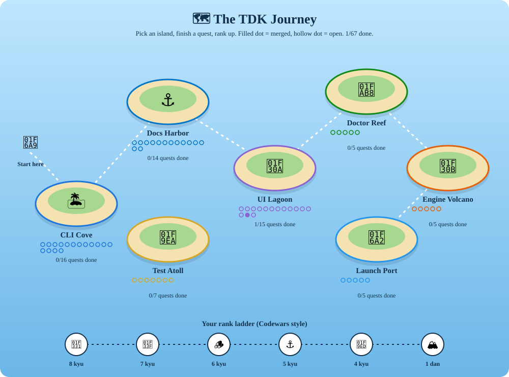

# The TDK Journey 🗺️



Contributing to TDK is a small adventure. Pick an island, finish quests, and rank up, Codewars style.

## How to play

1. **Pick an island** below. Each island has a head issue with a checklist of quests.
2. **Pick a quest** that matches your rank. Every issue carries a `rank:` label.
3. **Comment "I would like this one"** on the issue so nobody works on it twice. Questions are welcome there.
4. **Open a PR** (see [CONTRIBUTING.md](../../CONTRIBUTING.md)). When it merges, the dot on the map fills in.

## Ranks

| Rank | Label | What it feels like |
|---|---|---|
| 🌱 Seedling | `rank: 8 kyu` | A typo, a message, a tiny test. Perfect first PR |
| 🌿 Sprout | `rank: 7 kyu` | A small bug fix with a test |
| 🪵 Builder | `rank: 6 kyu` | A small feature or refactor across a few files |
| ⚓ Navigator | `rank: 5 kyu` | Needs design thinking, hooks or async care |
| 🧭 Pathfinder | `rank: 4 kyu` | Deep repo knowledge: the engine and discovery |
| 🏔️ Keeper | `rank: 1 dan` | RFCs and architecture. Talk to maintainers first |

Your rank is simply the hardest tier you have had merged. Merge a 7 kyu and you are a Sprout; there is no test and no gatekeeping, so skipping ahead is fine.

## Islands

| Island | Head issue | Good for |
|---|---|---|
| 🏝️ CLI Cove | [#459](https://github.com/tdk-landscape/tdk-cli-core/issues/459) | Commands, flags, error messages |
| 🌊 UI Lagoon | [#460](https://github.com/tdk-landscape/tdk-cli-core/issues/460) | The interactive `tdk ui` (React + Ink) |
| 🪸 Doctor Reef | [#461](https://github.com/tdk-landscape/tdk-cli-core/issues/461) | `tdk doctor` checks |
| ⚓ Docs Harbor | [#462](https://github.com/tdk-landscape/tdk-cli-core/issues/462) | Guides and README, no code needed |
| 🧪 Test Atoll | [#463](https://github.com/tdk-landscape/tdk-cli-core/issues/463) | Tests; the safest way to learn the code |
| 🌋 Engine Volcano | [#464](https://github.com/tdk-landscape/tdk-cli-core/issues/464) | Starlark engine and discovery |
| 🚢 Launch Port | [#465](https://github.com/tdk-landscape/tdk-cli-core/issues/465) | Packaging, CI, releases |

## Refreshing the map

The map is generated from the issue labels (`island: ...`, with `tracking` issues skipped):

```bash
node scripts/journey-map.mjs   # needs the gh CLI, rewrites docs/journey/map.svg
```

Maintainers: new quests only need an `island: ...` label and a `rank: ...` label to show up as a dot.
