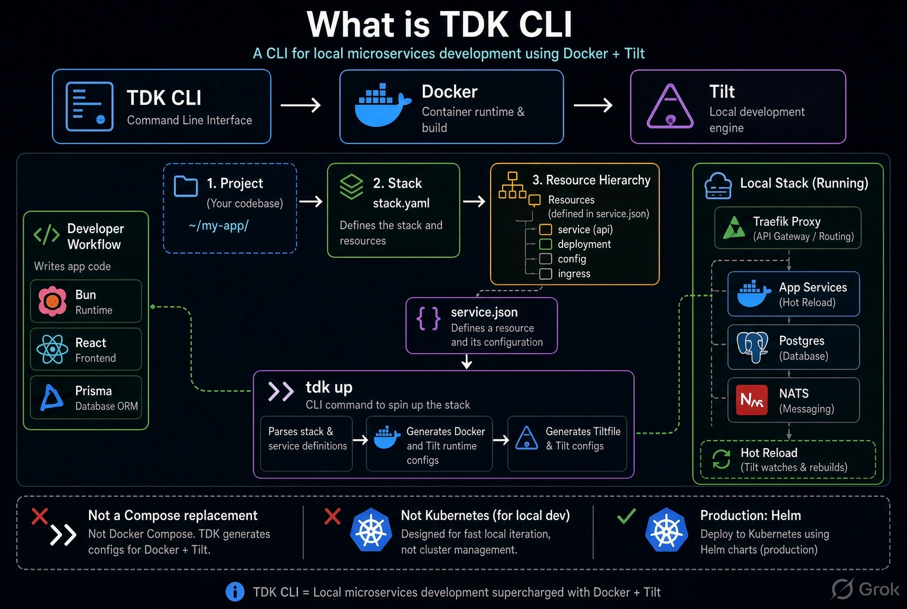

# Project overview

TDK is a local development kit. It organizes microservices using a **Project → Stack → Resource** hierarchy, then uses Tilt to build, run, and hot-reload them locally. It generates a Tiltfile, Dockerfiles, and supporting configuration; Tilt runs the local containers. See [TDK + Helm](with-helm.md) for the production handoff.

*The diagram's "stack.yaml" box is the stack grouping: in practice a stack is the `stack` field in each `service.json`, with project phases in `.tdk/project.json`.*

For a runnable one-service introduction, use [one-backend](../examples/one-backend/README.md). For a larger local multi-service project, see the [bundled TDK project example](../examples/tdk-example/README.md) or create a template with `tdk project example`.

A `.tdk/project.json` groups stacks into phases (`pre_alpha`, `alpha`, `beta`, `out_of_scope`) so a large system can be brought up in stages. `tdk up` runs stacks from the first three phases and adds newly discovered stacks to `pre_alpha`.

## Repository map

This is the core monorepo. Day-to-day CLI work is under `cli/`; `engine/` and `discovery/` implement the Tilt orchestration the CLI drives.

| Path | Contents |
|------|----------|
| [`cli/`](../cli) | CLI commands, UI, and templates. See [cli/README.md](../cli/README.md). |
| [`engine/`](../engine) | Starlark Tilt framework for Docker, networking, database virtualization, secrets, and observability. |
| [`discovery/`](../discovery) | Manifest discovery and dependency graphs. |
| [`ext/`](../ext) | Tilt extension and IDE/UI components. |
| [`scripts/`](../scripts) | Release, benchmark, and development tooling. |
| [`benchmarks/`](../benchmarks) | Container and landscape scale measurements. |
| [`Tiltfile`](../Tiltfile) | Entry point connecting Tilt to the engine. |

## Features and licensing

TDK includes Traefik and PostgreSQL, with optional monitoring, ELK, Debezium CDC, a local npm registry, and other project features. See [docs/FEATURES.md](FEATURES.md) for the full list.

The CLI, engine, and repository are MIT-licensed. Some optional features require a `TDK_LICENSE_KEY`, including on-demand service start/stop, Verdaccio, DDD scaffolding, Playwright configuration, C4 diagrams, synthetic monitoring, and selected generators. In this repository those are disabled stubs; with a key the CLI downloads their implementations. See [docs/FEATURES.md](FEATURES.md). Request a key through the [website](https://tdk-landscape.github.io/tdk-website/#waitlist) or a [premium license issue](https://github.com/tdk-landscape/tdk-cli-core/issues/new?template=premium_license.yml).

## Telemetry

TDK has no telemetry or analytics. The CLI connects to the network only when you ask it to, such as upgrading or fetching licensed extensions.
