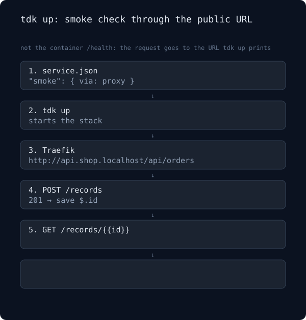

# Smoke check

`tdk up` can check your service through the URL it prints, not only inside the container. The drawing runs the same path twice: the route works (201, then 200, "Smoke check passed"), then the read-back returns 404 ("Smoke check failed", `tdk up` exits 1).

<p align="center">
  
</p>

GitHub's blob view often shows this drawing without the animation. [Open the raw SVG](assets/smoke.svg) to watch it loop (about 16 seconds: 8 for the pass, 8 for the fail).

```json
{
  "smoke": {
    "via": "proxy",
    "timeoutSeconds": 60,
    "steps": [
      { "name": "create", "method": "POST", "path": "/records", "body": { "name": "smoke" }, "expect": 201, "save": { "id": "$.id" } },
      { "name": "read back", "path": "/records/{{id}}", "expect": 200, "bodyContains": "smoke" }
    ]
  }
}
```

The check hits the public URL that `tdk up` prints, not the container's `/health`.

<<<<<<< HEAD
The body snippet in a failure line is a short, one-line excerpt for the terminal and is not kept. The retained copy is the record under `.tdk/smoke/<service>/<step-slug>/` (full body up to 64 KiB, plus the last passing response), which the failure line points to. In CI, `.github/workflows/smoke-e2e.yml` uploads that directory as an artifact, even when the run fails.
=======
The body snippet in a failure line is a short, one-line excerpt for the terminal and is not kept. The retained copy is the record under `.tdk/smoke/<service>/<step-slug>/` (full body up to 64 KiB, plus the last passing response), which the failure line points to. In CI, `.github/workflows/smoke-e2e.yml` uploads the records of its throwaway verify project as an artifact (14 days), even when the run fails. Bodies are stored as the service returned them, with no redaction, and a workflow artifact is readable by anyone who can read the run, so do not point a workflow at a smoke step whose response echoes a token or password.
>>>>>>> origin/main

Every field, the retry rules and what is not covered are in [Configuration: `smoke`](configuration.md#smoke-check-the-public-url-after-tdk-up). `scripts/verify-smoke.sh` runs both outcomes through a real `tdk up`.
