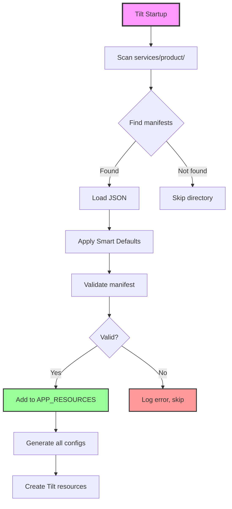
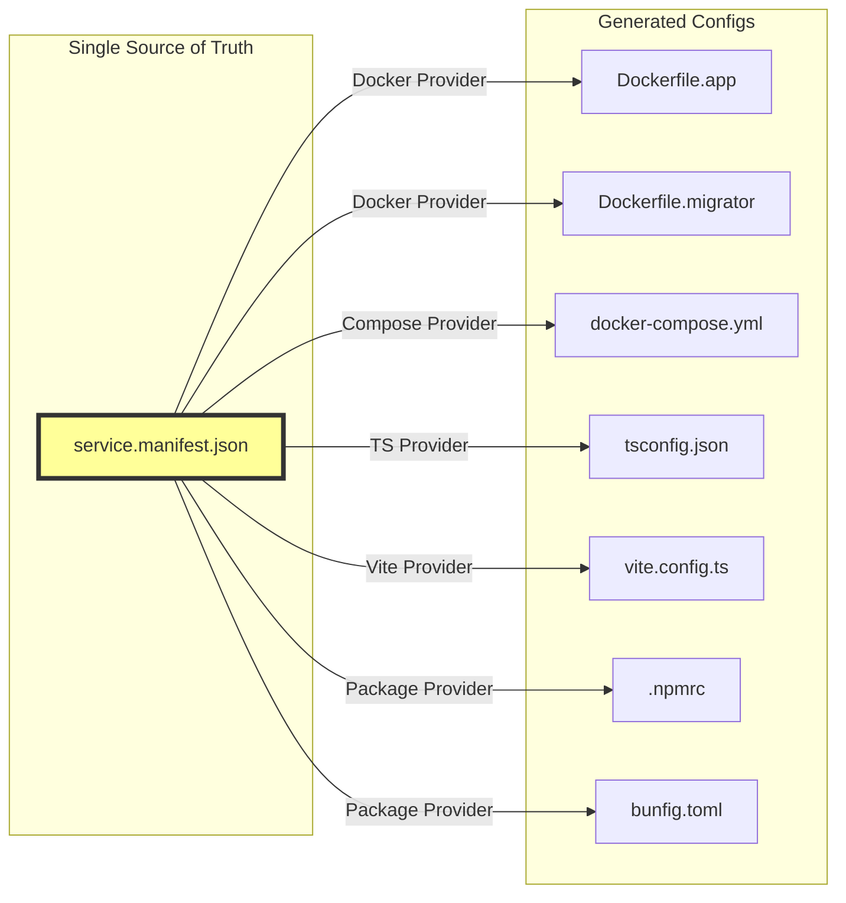
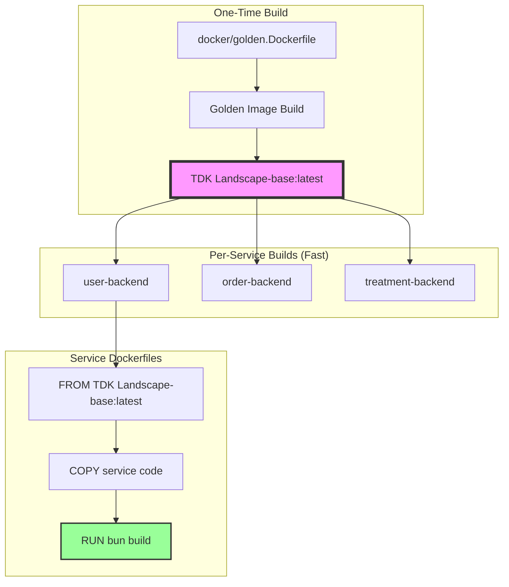
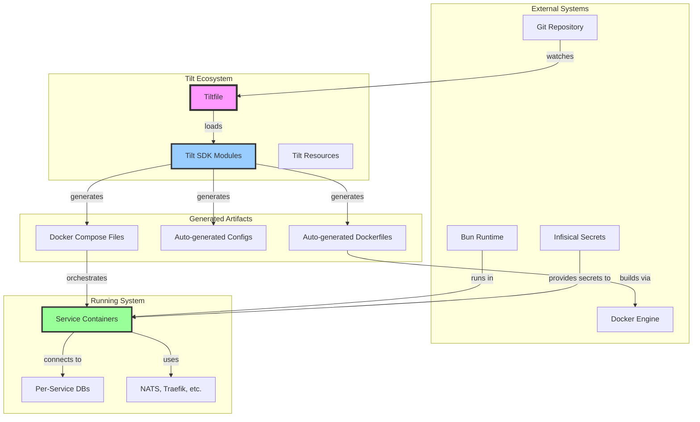
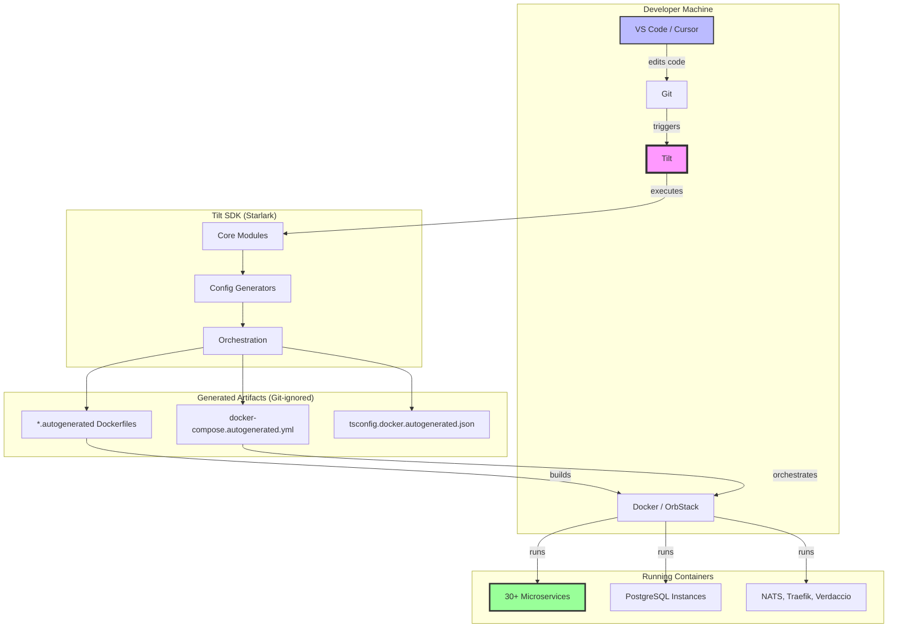

## Detailed Architecture Breakdown

### **Core Layer** (Foundation)

```
core/
├── utils.star              # Shared utilities, I/O, validation
├── manifest.star           # Service manifest loading & Smart Defaults
├── registry.star           # Single Source of Truth for all services
└── dependency-sync.star    # Automatic config regeneration
```

**Responsibilities**:
- File I/O with change detection
- JSON manifest parsing & validation
- Service discovery (auto-scans `services/product/`)
- Dependency resolution (package names → paths)
- Network repair utilities
- Environment validation

**Key Pattern**: Pure functions, no mutable global state (Starlark-safe)

---

### **Provider Layer** (Config Generators)

```
providers/
├── docker/
│   ├── layers/
│   │   ├── l1_base_layers.star       # OS base + runtime env
│   │   ├── l2_dependency_layers.star # Package manifest + install
│   │   ├── l3_builder_layers.star    # Compilation stage
│   │   └── l4_runtime_layers.star    # Final runtime
│   ├── compose.star                  # docker-compose generation
│   ├── dockerignore.star             # .dockerignore generation
│   └── golden-image.star             # Golden image workflow
├── typescript/
│   ├── backend_tsconfig.star         # Backend TypeScript config
│   ├── frontend_tsconfig.star        # Frontend TypeScript config
│   └── prisma_config.star            # Prisma-specific config
├── vite.star                         # Vite dev server config
└── npmrc.star                        # Package registry config
```

**Responsibilities**:
- Generate configuration files from manifests
- Multi-stage Dockerfile orchestration (L1→L2→L3→L4)
- TypeScript path mapping automation
- Vite alias synchronization
- Registry configuration (.npmrc, bunfig.toml)

**Key Innovation**: Layered Docker builds with surgical cache invalidation

---

### **Lifecycle Layer** (Orchestration)

```
lifecycle/
├── libs.star              # Shared library management
├── databases.star         # Database virtualization (per-service DBs)
├── orchestrator.star      # Service coordination & dependencies
├── infra-loader.star      # Infrastructure provisioning
└── watchers.star          # File change detection & triggers
```

**Responsibilities**:
- Shared library build orchestration
- Per-service database provisioning (`TDK_{domain}`)
- Service startup order (via dependency graph)
- Infrastructure bootstrapping (Postgres, NATS, Traefik)
- Hot-reload triggers on file changes

**Key Pattern**: Resource dependency graphs ensure correct startup order

---

### **Configuration Layer**

```
config.star               # Global config & Focus Mode
focus-mode.star           # Service filtering (--focus=user)
```

**Responsibilities**:
- CLI argument parsing (`--focus`, `--no-frontend`)
- Service enablement logic
- Environment variable loading
- Context building for all modules

---

## Data Flow Diagrams

### **1. Service Discovery Flow**



### **2. Manifest-Driven Config Generation**



### **3. Golden Image Build Strategy**



---

## Key Design Principles

### **1. Convention over Configuration**
```
Package name → Directory path (automatic)

@tdk-landscape/eventing → platform/packages/eventing/src
@tdk/domain            → shared-ddd-layers/domain/src
```

### **2. Single Source of Truth**
```
service.manifest.json → Everything else

One file defines:
- Service name, type, domain
- Port mapping
- Database name
- Dependencies
- Feature flags (prisma, nats, etc.)
```

### **3. Fail-Fast Validation**
```
Checks at tilt up:
✓ Manifest schema validation
✓ Circular dependency detection
✓ Network conflict resolution
✓ Infisical environment check
✓ Required secrets present
```

### **4. Self-Healing Systems**
```
Automatic fixes:
✓ Docker network conflicts → recreate networks
✓ Bun install cache corruption → retry without cache
✓ Missing golden image → build automatically
✓ Dependency changes → regenerate all configs
```

---

## Performance Optimizations

### **Build Time Reduction**

| Strategy | Impact | Implementation |
|----------|--------|----------------|
| **Golden images** | 98% faster | Pre-built base layers |
| **L1-L4 layering** | 5x cache hits | Surgical invalidation |
| **Parallel builds** | 3x faster | Tilt's concurrent resource loading |
| **Bun runtime** | 2x faster | vs Node.js |
| **Multi-stage builds** | 80% smaller images | Production purge layer |

### **Developer Productivity**

| Feature | Time Saved | Comparison |
|---------|-----------|------------|
| **Auto-discovery** | 30 min/service | vs manual Tiltfile edits |
| **Dependency sync** | 10 min/change | vs manual config updates |
| **Focus mode** | 5 min/restart | vs full stack rebuild |
| **Healthchecks** | 2 hours/incident | vs blind debugging |
| **Network auto-repair** | 15 min/conflict | vs manual Docker cleanup |

---

## System Boundaries

### **What Tilt Controls**
✅ Docker image generation  
✅ Container orchestration  
✅ Configuration file generation  
✅ Dependency graph management  
✅ Local development environment  
✅ Hot reload triggers  

### **What Tilt Doesn't Control**
❌ Production deployment  
❌ Cloud infrastructure  
❌ Monitoring/observability  
❌ CI/CD pipelines (that's GitHub Actions)  
❌ Application business logic  

---

## Integration Points



---

## Deployment View



---

## Comparison to Production Architecture

| Aspect | Tilt (Local Dev) | Production |
|--------|------------------|------------|
| **Orchestration** | Tilt + Docker Compose | Kubernetes / Cloud Run |
| **Service Discovery** | Manifest files | Service mesh / DNS |
| **Config Management** | Auto-generated files | ConfigMaps / Secrets |
| **Networking** | Docker networks | Cloud VPC / Load balancers |
| **Databases** | Local Postgres containers | Managed Postgres (Neon/RDS) |
| **Secrets** | Infisical CLI | Infisical API / Vault |
| **Observability** | Docker logs + Tilt UI | Prometheus + Grafana + Sentry |
| **Deployment** | `tilt up` | CI/CD → Cloud deploy |

---

## Conclusion

**Tilt SDK Architecture** = 5000+ lines of infrastructure-as-code that:

1. **Eliminates manual toil** (19% of files autogenerated)
2. **Enforces consistency** (one template → 30 services)
3. **Enables rapid development** (`git clone && tilt up`)
4. **Scales horizontally** (manifest discovery = no central file edits)
5. **Provides escape hatches** (can override any generated config)

**This is enterprise-grade developer tooling** built by one engineer over one year.
