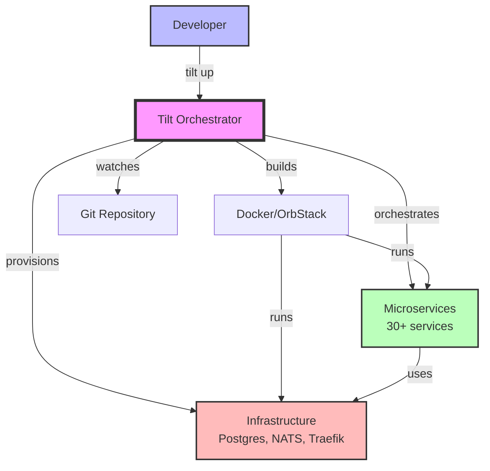
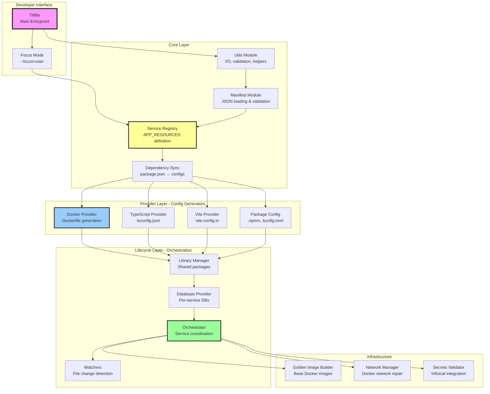
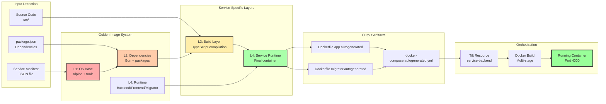
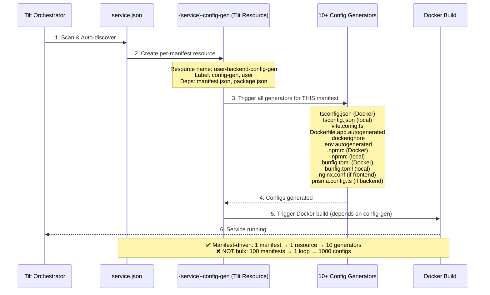
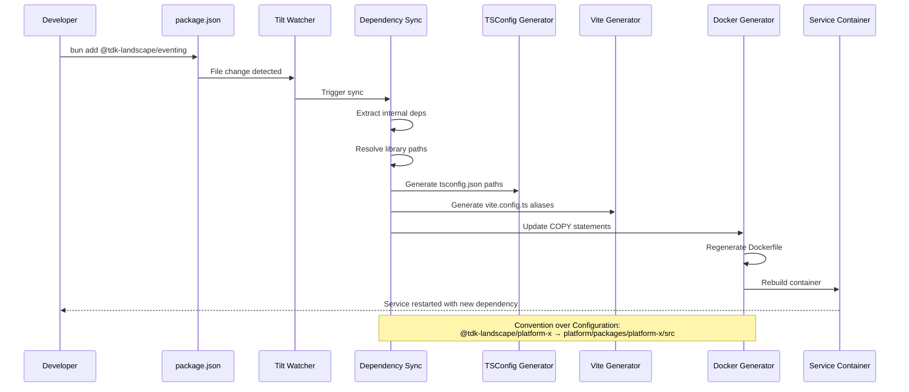

# TDK Landscape Tilt Architecture - C4 Model

## Level 1: System Context



**Purpose**: Tilt automates the entire local development lifecycle - from code changes to running containers.

---

## Level 2: Container Diagram - Tilt SDK Architecture



---

## Level 3: Component Diagram - Docker Build Pipeline



---

## Level 4A: Code Flow - Manifest-Driven Resource Creation



### Architecture Evolution

**Before (Bulk Generation)** - Lines 112-251 of apply.star:
```starlark
for resource in ALL_RESOURCES:  # 30 services
    generate_vite(resource)      # Loop 1
for resource in ALL_RESOURCES:
    generate_dockerfile(resource) # Loop 2
for resource in ALL_RESOURCES:
    generate_tsconfig(resource)   # Loop 3
# ... 7 more loops

# ❌ Problems:
# - No per-resource tracking in Tilt UI
# - Change 1 manifest → regenerate ALL configs
# - Can't see which config belongs to which service
```

**After (Manifest-Driven)** - Lines 114-136 of apply.star:
```starlark
for resource in resource_resources:
    manifest = load_manifest(resource)
    
    # Create ONE Tilt resource that generates ALL configs for THIS service
    config_gen_resource = ManifestResource.create_config_resource(
        resource_name, resource, manifest, backend_manifest, ctx
    )
    # Result: user-management-backend-config-gen (visible in Tilt UI)

# ✅ Benefits:
# - 30 granular Tilt resources (one per service)
# - Change 1 manifest → regenerate 10 configs for THAT service only  
# - Clear dependency: Docker build depends on config-gen resource
```

### Tilt UI Visibility

In Tilt dashboard you now see per-manifest resources:

```
📁 config-gen (label)
  ├─ user-management-backend-config-gen ✅
  ├─ user-management-frontend-config-gen ✅
  ├─ identity-management-backend-config-gen ✅
  ├─ identity-management-frontend-config-gen ✅
  └─ staff-management-backend-config-gen ✅

📁 user (label)
  ├─ user-management-backend-config-gen ⬆️ (dependency)
  ├─ user-management-backend ✅ (depends on config-gen)
  ├─ user-management-frontend-config-gen ⬆️ (dependency)
  └─ user-management-frontend ✅ (depends on config-gen)
```

### Dependency Chain

```
manifest.json  ─┐
package.json   ─┼─→ {service}-config-gen ───→ {service} (Docker)
                │    (10+ generators)           (depends on configs)
                │
Infrastructure ─┘
  golden-image-l1 → golden-image-l2 → verdaccio → postgres
```

---

## Level 4B: Code Flow - Dependency Synchronization



---

